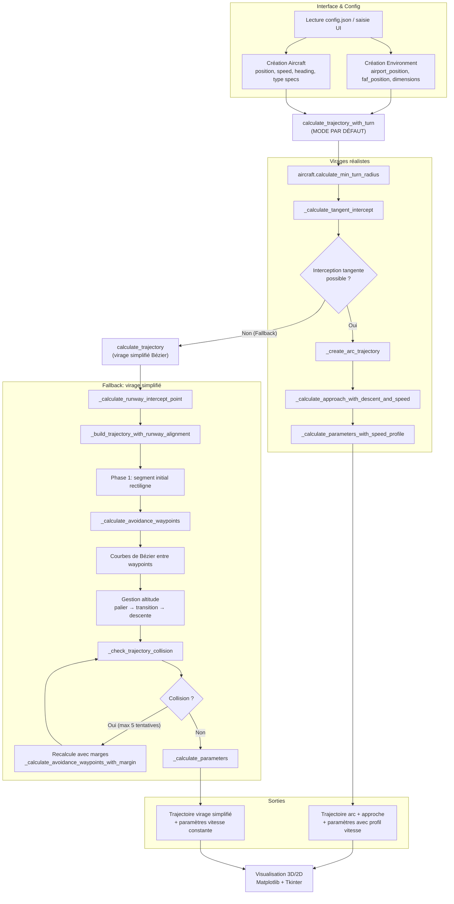

# Logique de Détermination de la Trajectoire

Ce document résume visuellement et schématiquement la logique utilisée pour calculer la trajectoire optimale vers le point FAF (Final Approach Fix) en respectant les contraintes de pente, d'alignement sur l'axe piste et d'évitement d'obstacles cylindriques.

---
## 1. Vue d'ensemble

Entrées principales:
- Paramètres avion (`Aircraft`): position, vitesse, cap, type (détermine pentes max, vitesses typiques)
- Environnement (`Environment`): dimensions, position aéroport, position FAF
- Obstacles: liste de cylindres (x, y, radius, height)

Sorties principales:
- Tableau de points 3D de la trajectoire (x, y, z)
- Paramètres calculés: distance totale, profil altitude, pentes, caps, taux de virage, temps de vol

---
## 2. Chaîne de traitement (flow général)

```text
┌────────────────────────┐
│   Interface GUI (Tk)   │
│  - Lecture config      │
│  - Saisie utilisateur  │
└──────────┬─────────────┘
           │ crée
           ▼
┌────────────────────────┐      ┌──────────────────────────┐
│     Environment        │◄────►│        Aircraft          │
│  airport_position      │      │ specs (pentes, vitesses) │
│  faf_position          │      │ position, heading        │
└──────────┬─────────────┘      └──────────┬──────────────┘
           │                                │
           └───────────────┬────────────────┘
                           ▼
                 ┌─────────────────────┐
                 │ TrajectoryCalculator │
                 └─────────┬───────────┘
                           │
                           ▼
          calculate_trajectory_with_turn (MODE PAR DÉFAUT)
                           │
                           ▼
        (arc de virage tangent + approche + descente)
                           │
              ┌────────────┴─────────────┐
              │                          │
              ▼                          ▼
    Interception tangente         Fallback si impossible:
         réussie                   calculate_trajectory
              │                    (virage simplifié vers FAF)
              │                          │
              └──────────┬───────────────┘
                         ▼
              Trajectoire finale + paramètres
```

---
## 3. Logique détaillée du mode principal (`calculate_trajectory_with_turn`)

**MODE PAR DÉFAUT (100% des cas) :**

Le système utilise **toujours** le mode "virages réalistes" qui calcule une trajectoire avec arc tangent à l'axe d'approche :

1. Calcule le rayon de virage minimal selon la vitesse et l'inclinaison max de l'avion
2. Détermine l'axe piste: vecteur (FAF → Aéroport) = direction de l'approche
3. Calcule le point d'interception tangent entre le cercle de virage et l'axe d'approche via `_calculate_tangent_intercept`
4. Si l'interception tangente est **possible** :
   - Génère l'arc de virage (`_create_arc_trajectory`)
   - Approche finale rectiligne avec descente + décélération (`_calculate_approach_with_descent_and_speed`)
   - Calcul des paramètres avec profil de vitesse variable (`_calculate_parameters_with_speed_profile`)
5. Si l'interception tangente est **impossible** (géométrie défavorable, avion trop éloigné de l'axe) :
   - **Fallback automatique** sur `calculate_trajectory` (voir section 3bis)
   - Ce mode simplifié construit une trajectoire avec virage progressif (Bézier) vers le FAF

**Important :** Il n'y a plus de choix utilisateur entre modes. Le système sélectionne automatiquement la meilleure approche selon la géométrie.

---
## 3bis. Logique du mode fallback (`calculate_trajectory`)

Ce mode est utilisé **uniquement en fallback** lorsque l'interception tangente est impossible :

1. Récupère positions: départ avion, FAF, aéroport
2. Calcule l'axe piste: vecteur (FAF → Aéroport) = direction de l'approche
3. Calcule angle entre cap actuel et axe piste
4. Détermine un point d'interception sur l'axe (souvent juste avant le FAF) via `_calculate_runway_intercept_point`
5. Construit la trajectoire en 2 phases via `_build_trajectory_with_runway_alignment`:
   - Phase 1: Vol initial rectiligne (cap actuel) sur une distance courte
   - Phase 2: Virage progressif (Bézier cubique) jusqu'au FAF en étant aligné avec la piste
   - Gestion altitude: palier → transition ultra-douce (smoothstep 7ème degré) → descente linéaire à pente max
   - Évitement obstacles: génération de waypoints de contournement `_calculate_avoidance_waypoints`
6. Validation collision (`_check_trajectory_collision`). Si collision:
   - Tentatives de recalcul avec marges augmentées (`_calculate_avoidance_waypoints_with_margin`)
   - Stockage des trajectoires de tentative (`retry_trajectories`)
7. Calcul des paramètres finaux via `_calculate_parameters`

---
## 4. Mode virages réalistes (MODE PAR DÉFAUT - 100% des cas)

Objectif: Produire un arc de virage tangent à l'axe d'approche avant la descente.

Étapes:
- Calcule rayon de virage minimal (`Aircraft.calculate_min_turn_radius`)
- Géométrie tangentielle (`_calculate_tangent_intercept`) pour trouver point d'interception + centre de virage
- Si **possible** :
  - Génère l'arc (`_create_arc_trajectory`)
  - Approche finale rectiligne avec descente + décélération (`_calculate_approach_with_descent_and_speed`)
  - Paramètres avec profil de vitesse variable (`_calculate_parameters_with_speed_profile`)
- Si **impossible** (discriminant négatif / distance) :
  - Fallback automatique sur `calculate_trajectory` (virage simplifié Bézier)

**Note :** Ce mode est toujours activé. Il n'y a plus de choix utilisateur.

---
## 5. Gestion altitude (concept transversal)
Phases typiques quand descente nécessaire:
```
[ PALIER ] ----> [ TRANSITION DOUCE ] ----> [ DESCENTE LINÉAIRE ] ----> [ LISSAGE FINAL FAF ]
         distance_level       distance_transition        distance_descent
```
Fonctions impliquées:
- `_build_trajectory_with_runway_alignment`
- `_calculate_trajectory_with_slope_constraint` (alternative linéaire + transition cosinus)
- `_calculate_approach_with_descent_and_speed`
- `_calculate_trajectory_along_runway`

Techniques de lissage utilisées:
- Smoothstep quintic: `6t^5 - 15t^4 + 10t^3`
- Super-smoothstep 7ème degré: `-20t^7 + 70t^6 - 84t^5 + 35t^4`
- Cosinus easing: `(1 - cos(pi*t))/2`
- Moyenne mobile pondérée (25%-50%-25%) pour l'altitude finale `_smooth_trajectory`

---
## 7. Évitement d'obstacles
Principe: S'insérer des waypoints latéraux pour contourner chaque cylindre détecté sur le segment vers le FAF.

Fonctions clés:
- `_calculate_avoidance_waypoints`: version normale (rayon + marge réduite)
- `_calculate_avoidance_waypoints_with_margin`: utilisée en recalcul en cas de collision (marges croissantes)
- `_check_trajectory_collision`: validation globale
- `_check_collision_with_cylinder`: test d'un point individuel
- `_calculate_avoidance_point`: génération d'un point latéral (utilisé dans autres stratégies)

Stratégie recalcul en cas d'échec:
1. Collision détectée → boucle de 5 tentatives avec facteur sécurité croissant
2. Si toujours collision → échec explicite et recommandations (modifier position ou obstacles)

---
## 8. Liste des fonctions et rôles (référence rapide)

### TrajectoryCalculator

**Calcul de trajectoire principal :**
- `calculate_trajectory(aircraft, cylinders)`: Trajectoire standard alignée sur l'axe piste (mode fallback)
- `calculate_trajectory_with_turn(...)`: Mode virage tangent réaliste (arc + approche) **[MODE PAR DÉFAUT]**

**Construction de trajectoire :**
- `_calculate_runway_intercept_point(...)`: Point d'interception sur axe avant FAF
- `_build_trajectory_with_runway_alignment(...)`: Construction multi-phases + évitement + gestion altitude
- `_calculate_simple_trajectory(...)`: Ligne droite dense (cas trivial)
- `_vertical_trajectory(...)`: Descente verticale (déjà au-dessus du FAF)
- `_calculate_trajectory_with_slope_constraint(...)`: Variante palier → transition → descente
- `_calculate_trajectory_along_runway(...)`: Ligne sur axe piste avec descente lissée

**Calculs géométriques :**
- `_calculate_tangent_intercept(...)`: Géométrie tangente cercle/axe approche
- `_create_arc_trajectory(...)`: Génération arc de virage
- `_calculate_approach_with_descent_and_speed(...)`: Approche finale avec descente + décélération

**Évitement d'obstacles :**
- `_calculate_avoidance_waypoints(...)`: Waypoints contournement (marge standard)
- `_calculate_avoidance_waypoints_with_margin(...)`: Waypoints contournement (marge personnalisée)
- `_check_collision_with_cylinder(...)`: Test collision point/cylindre
- `_check_trajectory_collision(...)`: Validation collision trajectoire complète

**Paramètres de vol :**
- `_calculate_parameters(...)`: Profil de vol (temps, pente, cap, taux de virage)
- `_calculate_parameters_with_speed_profile(...)`: Idem mais vitesse variable

Aircraft:
- `calculate_min_turn_radius(speed=None)`: Rayon minimal selon vitesse et inclinaison max
- `get_approach_speed()`: Vitesse d'approche finale typique

Environment:
- Fournit `airport_position`, `faf_position`, angle approche

---
## 9. Schéma simplifié décisionnel
```text
        Début
          │
          ▼
   calculate_trajectory_with_turn (MODE PAR DÉFAUT)
          │
          ▼
   Calcul rayon de virage minimal
   + Géométrie tangente (arc/axe)
          │
    ┌─────┴─────┐
    │           │
   Oui         Non
    │           │
    ▼           ▼
 Tangence    Fallback:
 possible   calculate_trajectory
    │        (virage Bézier)
    │           │
    ▼           │
 Arc + Approche │
 + Descente     │
    │           │
    └─────┬─────┘
          │
          ▼
  (Dans tous les modes: gestion altitude + évitement obstacles + validation collision)
          │
          ▼
      Paramètres calculés (_calculate_parameters / _calculate_parameters_with_speed_profile)
          │
          ▼
        Fin
```

---
## 10. Points clés de robustesse
- Lissage intensif pour éviter les cassures d'altitude (smoothstep haute commande, cosinus, moyenne mobile)
- Recalcule automatique si collision (marges croissantes)
- Séparation claire des phases (initial, transition, descente, finale)
- Adaptation dynamique selon distance disponible vs pente imposée

---
## 11. Pistes d'amélioration possibles
- Ajout de tests unitaires sur fonctions de géométrie et évitement
- Export des trajectoires (GeoJSON / KML pour Google Earth / CSV)
- Ajout d'un modèle de consommation carburant
- Mode de comparaison de trajectoires (overlay multiple scenarios)
- Génération automatique de rapports PDF avec statistiques
- Intégration du vent (vecteur vitesse sol vs air)
- Optimisation multi-objectifs (distance vs confort vs sécurité vs carburant)
- Contraintes temporelles (fenêtres d'atterrissage)
- Support de waypoints intermédiaires obligatoires

---
## 12. Résumé éclair (TL;DR)

Le système utilise **toujours le mode "virages réalistes"** qui calcule une trajectoire avec arc tangent à l'axe d'approche, suivi d'une descente progressive. Si la géométrie ne permet pas de construire cet arc tangent (avion trop éloigné de l'axe), le système bascule automatiquement sur un mode simplifié avec virage progressif (Bézier) vers le FAF. 

Dans tous les cas, la trajectoire gère : orientation vers l'axe piste, altitude (palier → transition ultra-douce → descente à pente max), et évitement d'obstacles via waypoints tangents. Chaque segment est densément échantillonné et lissé pour une représentation fluide.

---
*Document généré automatiquement.*

---

## 13. Schéma fonctionnel ultra détaillé

Ce schéma expose le pipeline complet, les décisions clés, et les fonctions exactes appelées à chaque étape.

### 13.1 Diagramme global (Mermaid)



### 13.2 Cartographie fonctionnelle (ASCII + I/O)

```text
[Inputs]
   - Aircraft: position[x,y,z], speed, heading, type → specs(max_descent_slope, max_bank_angle, ...)
   - Environment: airport_position[x,y,z], faf_position[x,y,z], sizeX/Y/Z
   - Obstacles: list[{x, y, radius, height}]

[Mode Principal : Virages Réalistes - PAR DÉFAUT]
   1) aircraft.calculate_min_turn_radius(speed)
   2) _calculate_tangent_intercept(start_2D, current_dir, approach_dir, airport_2D, faf_2D, radius)
       - si échec → fallback mode simplifié
   3) _create_arc_trajectory(...)
   4) _calculate_approach_with_descent_and_speed(...)
   5) _calculate_parameters_with_speed_profile(...)

[Mode Fallback : Virage Simplifié]
   1) _calculate_runway_intercept_point(start_2D, current_dir, airport_2D, faf_2D, runway_dir, angle)
       → intercept_2D
   2) _build_trajectory_with_runway_alignment(..., cylinders)
       → segments:
            - initial_segment (rectiligne, altitude constante)
            - pour chaque [wp_i → wp_{i+1}]: Bézier cubique 2D
               altitude = f(distance) avec 3 phases (palier/transition/descente)
            - validation: _check_trajectory_collision(trajectory, cylinders)
                  si collision → _calculate_avoidance_waypoints_with_margin(...), rebuild (≤ 5)
       → trajectory[Nx3]
   3) _calculate_parameters(trajectory, speed)
       → time[N], altitude[N], slope[N], heading[N], turn_rate[N], distance, flight_time

[Outputs]
   - Trajectory: array float64 (N x 3)
   - Parameters: dict{time[N], altitude[N], slope[N], heading[N], turn_rate[N], distance, flight_time}
   - Debug: retry_trajectories[], retry_trajectories_info[] (si recalculs)
```

### 13.3 Points de contrôle et échecs gérés
- **Collisions obstacles**: rejet + tentatives avec marges croissantes; si 5 échecs → échec explicite et recommandations
- **Interception tangente impossible**: fallback immédiat sur trajectoire standard avec virage Bézier
- **Lissages systématiques**: transitions d'altitude (quintic/super-smoothstep 7ème degré) pour continuité
- **Validation à chaque étape**: vérification géométrique avant génération de chaque segment

---

## 14. Référence détaillée par fonction (API + algorithmes)

Cette section documente chaque fonction avec: objectif, entrées/sorties, logique, cas limites, et notes d'implémentation. Les distances sont en km, les vitesses en km/h, les angles en degrés (sauf mention explicite en radians). Les coordonnées suivent l'axe XY horizontal et Z l'altitude.

### 14.1 TrajectoryCalculator — API principale et helpers

#### calculate_trajectory(aircraft, cylinders=None)
- But: Calcul standard d’une trajectoire jusqu’au FAF avec alignement progressif sur l’axe de piste, gestion d’altitude et évitement d’obstacles.
- Entrées:
   - aircraft: `Aircraft`
   - cylinders: liste d’obstacles `{x, y, radius, height}` (optionnel)
- Sorties: `(trajectory: ndarray[Nx3], parameters: dict)`
- Logique:
   1) Calcule l’axe d’approche (FAF→aéroport).
   2) Détermine la direction actuelle à partir du cap, l’angle au runway, la distance horizontale.
   3) Si très proche du FAF: verticale via `_vertical_trajectory`.
   4) Sinon, calcule un point d’interception sur l’axe via `_calculate_runway_intercept_point` (utilisé surtout pour information et debug).
   5) Construit la trajectoire en 2 phases (segment initial rectiligne + virage/alignement jusqu’au FAF) via `_build_trajectory_with_runway_alignment` (inclut altitude et évitement).
- Cas limites: FAF≈aéroport, distance<0.1 km, angle extrême, pas d’obstacles.

#### _build_trajectory_with_runway_alignment(aircraft, start_pos, intercept_point, faf_pos, current_dir, runway_dir, cylinders=None)
- But: Construire une trajectoire lisse en deux phases avec respect de la pente max et contournement d’obstacles.
- Entrées: positions 3D (start/faf), `current_dir` et `runway_dir` 2D unitaires, `cylinders`.
- Sorties: `(trajectory, parameters)`
- Algorithme:
   - Phase 1: segment initial rectiligne (15–25% distance totale, borné 1–5 km) à altitude constante.
   - Phase 2: suite de courbes de Bézier cubiques entre waypoints (entrée, waypoints d’évitement optionnels, FAF). Contrôles P0..P3 paramétrés pour assurer continuité des tangentes et alignement final avec `runway_dir`.
   - Altitude: profil en 3 phases contrôlé par distances calculées vs pente max: palier, transition ultra-douce (super-smoothstep 7e degré), puis descente linéaire jusqu’au FAF. Lissage terminal sur les derniers points pour garantir arrivée exacte au FAF.
   - Collisions: `_check_trajectory_collision`; si collision, reconstruire jusqu’à 5 tentatives avec waypoints recalculés par `_calculate_avoidance_waypoints_with_margin` (marge croissante).
- Cas limites: distance insuffisante pour palier→transition→descente; segments très courts; obstacles tangents.

#### _calculate_runway_intercept_point(start_2D, current_dir, airport_2D, faf_2D, runway_dir, angle_to_runway)
- But: Trouver un point sur l’axe de piste où viser pour un alignement progressif avant le FAF.
- Idée clé: projection orthogonale de la position avion sur l’axe piste pour mesurer l’écart perpendiculaire et la distance résiduelle jusqu’au FAF; l’« intercept » est posé juste avant le FAF en fonction de l’angle et de la distance disponible (avec marge de sécurité).
- Sortie: `intercept_point` 2D sur l’axe piste.
- Cas limites: si l’avion est très en arrière de l’aéroport, l’intercept est ramené plus loin en amont pour donner du temps à l’alignement.

#### _calculate_trajectory_with_slope_constraint(aircraft, start_pos, target_pos)
- But: Construire une trajectoire rectiligne en 3 phases palier→transition (cosinus)→descente linéaire quand seul le respect de pente compte (sans virage complexe).
- Entrées/Sorties: `(trajectory, parameters)`
- Formules: distance minimale de descente $d_{min}=|\Delta z|/\tan(|\theta_{max}|)$; transition ~15% de $d_{min}$ bornée [1,3] km; densité élevée (≥500 points ou 100 pts/km).
- Cas limites: si $d_{min}+transition >$ distance dispo, pas de palier; lissage final pour arriver exactement au FAF.

#### _calculate_simple_trajectory(aircraft, start_pos, target_pos)
- But: Interpolation linéaire dense start→target (min 500 points, 100 pts/km) + paramètres.

#### _vertical_trajectory(aircraft, start_pos, target_pos)
- But: Descente/ montée purement verticale lorsque la position XY est déjà au FAF.
- Détails: 300+ points (200 pts/km d’écart vertical) avec easing smooth (ease-in-out) sur Z; vitesse verticale artificielle de référence (10 km/h) pour les temps.

#### _calculate_trajectory_along_runway(aircraft, start_pos, faf_pos, runway_dir)
- But: Trajet sur l’axe piste avec gestion d’altitude ultra-douce (quintic) jusqu’au FAF.
- Altitude: palier → transition quintic (6t^5 − 15t^4 + 10t^3) → descente constante; lissage final sur N derniers points et point final forcé = FAF.
- Usage: composant dans d’autres modes ou cas alignés.

#### _calculate_parameters(trajectory, speed)
- But: Extraire les grandeurs de vol le long de la trajectoire à vitesse constante.
- Sorties:
   - time[s] (linéarisé via distance cumulée / speed), altitude[z], slope[deg] entre points, heading[deg] (atan2(dx,dy)), turn_rate[deg/s].
- Détails: gestion robuste des divisions par zéro, normalisation du heading 0–360, continuité d’angle pour turn_rate (wrap ±180°).

#### _calculate_parameters_with_speed_profile(trajectory, initial_speed, arc_length, speed_profile)
- But: Même calcul que ci-dessus mais avec vitesse variable: virage à vitesse constante, approche avec profil fourni.
- Entrées: `arc_length` = nombre de points du virage; `speed_profile` aligne la phase d’approche.
- Temps: somme des temps segmentaires avec vitesse moyenne locale.

#### calculate_trajectory_with_turn(aircraft, cylinders=None)
- But: Mode « virages réalistes » avec arc tangent à l’axe d’approche puis approche rectiligne avec descente et décélération.
- Étapes: rayon min (`aircraft.calculate_min_turn_radius`) → `_calculate_tangent_intercept` → `_create_arc_trajectory` → `_calculate_approach_with_descent_and_speed` → `_calculate_parameters_with_speed_profile`.
- Fallback: si tangence impossible, repasse sur `calculate_trajectory` classique (avec obstacles).

#### _calculate_tangent_intercept(start_2D, current_dir, approach_dir, airport_2D, faf_2D, radius)
- But: Trouver le point d’interception tangent entre le cercle de virage et l’axe d’approche.
- Algorithme: calcule le centre du cercle côté rotation, puis résout l’équation quadratique de la distance du centre à la droite d’approche égale au rayon. Choisit la solution avant le FAF. Renvoie aussi l’angle d’arc à parcourir.
- Sorties: `(intercept_point, turn_center, turn_angle)` ou `(None, None, None)` si pas de solution (discriminant<0, géométrie défavorable).

#### _create_arc_trajectory(start_2D, center, angle, radius, altitude)
- But: Générer les points d’un arc circulaire à altitude constante; environ 1 pt/2° (min 10 pts).
- Sortie: `ndarray[Kx3]` du virage.

#### _calculate_approach_with_descent_and_speed(aircraft, start_pos, target_pos, direction, target_speed)
- But: Approche rectiligne avec descente progressive (palier→transition cosinus→linéaire) et décélération de la vitesse initiale vers `target_speed`.
- Détails: densité ≥500 points (~100 pts/km), décélération démarrant au dernier tiers de la distance, easing cosinus pour la vitesse et pour la transition d’altitude.

#### _calculate_avoidance_waypoints(start_2d, end_2d, cylinders, altitude)
- But: Détecter les cylindres intersectant le segment direct et générer des points d’entrée/sortie latéraux (côté choisi par produit vectoriel) pour longer le périmètre avec une petite marge.
- Détails: projection du centre sur le segment, test de distance au segment < rayon+marge; points décalés perpendiculairement avec correction pour rester ≥ rayon+marge.

#### _calculate_avoidance_waypoints_with_margin(start_2d, end_2d, cylinders, altitude, safety_factor)
- But: Variante avec marge personnalisée utilisée pendant les tentatives de recalcul (marges croissantes).

#### _check_collision_with_cylinder(point, cylinder)
- But: Test ponctuel d’inclusion 3D dans un cylindre: distance XY ≤ rayon ET 0 ≤ z ≤ hauteur.
- Retour: bool.

#### _check_trajectory_collision(trajectory, cylinders)
- But: Balayage de toute la trajectoire pour identifier les cylindres touchés et l’index du premier point en collision.
- Sorties: `(has_collision: bool, colliding_indices: list[int], first_idx: int)`

### 14.2 Aircraft — types et dynamique simple

#### AircraftType.SPECIFICATIONS
- Contenu: paramètres par type (« light », « commercial », « cargo »): pentes max, vitesses typiques/approche, limites de vitesse, inclinaison max.

#### AircraftType.get_all_types()
- Retourne la liste des types disponibles.

#### AircraftType.get_specifications(aircraft_type)
- Retourne le dictionnaire de spécifications du type (défaut: « commercial » si inconnu).

#### Aircraft.__init__(position, speed, heading=0.0, aircraft_type="commercial", max_climb_slope=None, max_descent_slope=None)
- But: Initialiser un avion; charge les specs du type et permet d’écraser les pentes max.

#### Aircraft.get_state()
- Retour: dict lisible contenant position, vitesse, cap, altitude et pentes max.

#### Aircraft.calculate_min_turn_radius(speed=None)
- Formule: $R = \dfrac{V^2}{g\tan(\phi)}$ avec V en m/s, g=9.81, φ = angle d’inclinaison max; résultat converti en km.
- Usage: dimensionnement des virages réalistes et spirales.

#### Aircraft.get_approach_speed()
- Retourne la vitesse d’approche du type (fallback: 70% de la vitesse si non défini).

### 14.3 Environment — positions de référence

#### Environment.__init__(size_x=50, size_y=50, size_z=5)
- But: Définir l’espace, la position de l’aéroport (au sol, coin 90%) et un FAF à ~5 km en amont sur une direction SW, altitude 0.5 km. Angle d’approche final nominal = 3°.

#### Environment.get_airport_info() / get_faf_info()
- Retour: dictionnaires {x,y,z} utiles pour l’UI/logs.

---

## 15. Conseils d’utilisation et lecture des paramètres

- Les paramètres retournés par `_calculate_parameters` et `_calculate_parameters_with_speed_profile` sont synchronisés point à point avec `trajectory`. Les index clés comme `initial_segment_end`, `turn_segment_end`, ou `descent_start_index` aident à segmenter l’affichage.
- Les fonctions internes préfixées par « _ » ne sont pas destinées à être appelées directement depuis l’UI, mais documentées pour compréhension et tests unitaires ciblés.
- En présence d’obstacles denses, attendez-vous à plusieurs trajectoires « retry » stockées dans `retry_trajectories` et `retry_trajectories_info` pour debug/visualisation.
