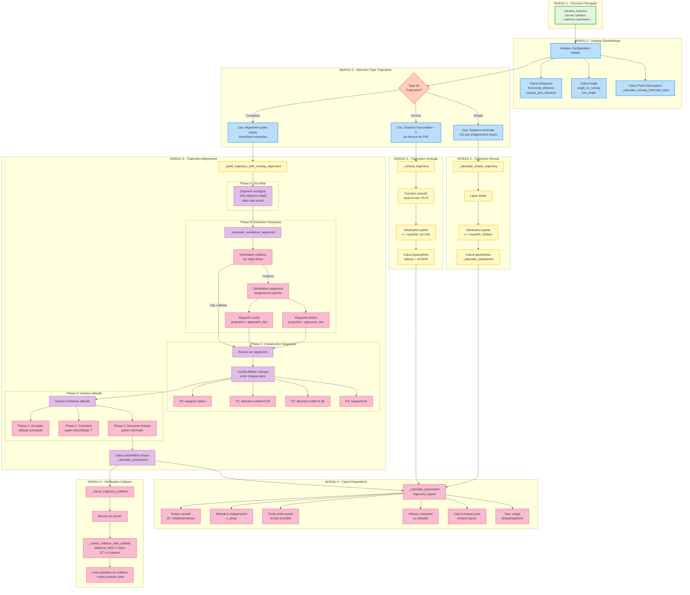

# DÉCOMPOSITION FONCTIONNELLE - TrajectoryCalculator



## Détail des Niveaux de Décomposition

### NIVEAU 1 - Point d'Entrée
**`calculate_trajectory(aircraft, cylinders)`**
- Input: objet Aircraft, liste obstacles
- Output: numpy array trajectoire (N×3), dict paramètres
- Fonction principale appelée par l'interface

### NIVEAU 2 - Analyse et Décision
**Analyse géométrique:**
- Calcul distance horizontale avion → FAF
- Calcul angle entre cap actuel et axe piste
- Détermination point interception optimal sur axe piste

**Décision type trajectoire:**
- Simple: distance courte, pas d'alignement
- Verticale: position XY ≈ FAF (descente pure)
- Complexe: alignement piste + évitement obstacles

### NIVEAU 3 - Types de Trajectoires

#### Trajectoire Simple
- Ligne droite start → FAF
- Densité: 100 points/km minimum
- Descente linéaire si altitude différente

#### Trajectoire Verticale
- Cas spécial: avion au-dessus du FAF
- Fonction smooth ease-in-out pour descente douce
- Vitesse réduite: 10 km/h

#### Trajectoire Complexe
Décomposée en 4 phases séquentielles

### NIVEAU 4 - Sous-Fonctions Détaillées

#### Phase A: Vol Initial Rectiligne
- 20% de la distance totale
- Maintien du cap actuel
- Altitude constante

#### Phase B: Détection et Évitement
**Algorithme waypoints:**
1. Projection centre cylindre sur trajet
2. Si distance < rayon → génération waypoints
3. WP_entrée = projection - approach_distance
4. WP_sortie = projection + approach_distance
5. Décalage perpendiculaire = rayon + marge

#### Phase C: Construction Segments Bézier
**Pour chaque paire de waypoints:**
- P0: position départ segment
- P1: P0 + direction_entrée × 0.35 × distance
- P2: P3 - direction_sortie × 0.35 × distance  
- P3: position fin segment
- Interpolation cubique: P(t) = (1-t)³P₀ + 3(1-t)²tP₁ + 3(1-t)t²P₂ + t³P₃

#### Phase D: Gestion Altitude 3 Phases
1. **Palier** (0 → distance_palier):
   - Altitude = altitude_départ

2. **Transition** (distance_palier → distance_palier + transition):
   - Super-smoothstep 7ème degré: -20t⁷ + 70t⁶ - 84t⁵ + 35t⁴
   - Dérivées 1 et 2 nulles aux bornes
   - Transition imperceptible

3. **Descente** (après transition → FAF):
   - Pente = max_descent_slope (constante)
   - Linéaire jusqu'au FAF

#### Calcul Paramètres
**Pour chaque point de trajectoire:**
- **Temps**: somme cumulative Δdistance/vitesse
- **Altitude**: valeur Z du point
- **Pente**: arctan(Δz / distance_horizontale)
- **Vitesse**: constante (sauf cas vertical)
- **Cap**: arctan2(Δy, Δx) en degrés
- **Taux virage**: (cap[i] - cap[i-1]) / Δt

#### Vérification Collision
- Parcours de tous les points trajectoire
- Test pour chaque cylindre:
  - Distance horizontale ≤ rayon
  - ET altitude ≤ hauteur
- Retour: liste cylindres en collision + index

## Complexité et Performance

| Fonction | Complexité | Points générés |
|----------|-----------|----------------|
| Simple | O(n) | 500 - 10000 |
| Verticale | O(n) | 300 - 2000 |
| Complexe | O(n×m×k) | 5000 - 50000 |

*n = points trajectoire, m = waypoints, k = obstacles*

## Formules Clés

**Distance minimale descente:**
```
d_min = |Δz| / tan(|max_descent_slope|)
```

**Bézier cubique:**
```
P(t) = (1-t)³P₀ + 3(1-t)²tP₁ + 3(1-t)t²P₂ + t³P₃
```

**Super-smoothstep:**
```
f(t) = -20t⁷ + 70t⁶ - 84t⁵ + 35t⁴
```

**Décalage perpendiculaire:**
```
perp = [-direction_y, direction_x]
waypoint = point_base + side × perp × (rayon + marge)
```
