# LOGIQUE DE DÉCISION - Calcul Trajectoire Optimale

```mermaid
flowchart TD
    START([Début calculate_trajectory<br/>aircraft, cylinders]) --> INPUT[Récupération données:<br/>• position_start<br/>• position_FAF<br/>• position_airport<br/>• liste cylinders]
    
    INPUT --> CALC_AXIS[Calcul axe piste:<br/>runway_axis = airport - FAF<br/>runway_distance = norm runway_axis]
    
    CALC_AXIS --> CHECK_RUNWAY{runway_distance<br/>< 0.1 km ?}
    
    CHECK_RUNWAY -->|OUI| SIMPLE1[Type: TRAJECTOIRE SIMPLE<br/>Pas d'axe piste défini]
    CHECK_RUNWAY -->|NON| CALC_DIR[Calcul directions:<br/>• runway_direction normalisé<br/>• current_direction depuis heading<br/>• angle_to_runway]
    
    CALC_DIR --> CALC_DIST[Calcul distance horizontale:<br/>horizontal_distance = norm FAF_xy - start_xy]
    
    CALC_DIST --> CHECK_HORIZ{horizontal_distance<br/>< 0.1 km ?}
    
    CHECK_HORIZ -->|OUI| VERTICAL[Type: TRAJECTOIRE VERTICALE<br/>Avion au-dessus du FAF]
    CHECK_HORIZ -->|NON| CALC_INTERCEPT[Calcul point interception:<br/>_calculate_runway_intercept_point]
    
    CALC_INTERCEPT --> COMPLEX[Type: TRAJECTOIRE COMPLEXE<br/>Alignement + Évitement]
    
    subgraph TRAJ_SIMPLE["TRAJECTOIRE SIMPLE"]
        SIMPLE1 --> S1[Vecteur direct:<br/>distance_vector = FAF - start]
        S1 --> S2[Calcul nombre points:<br/>n = max500, distance × 100]
        S2 --> S3[Génération points linéaires:<br/>t ∈ 0,1<br/>point = start + t × distance_vector]
        S3 --> S4[Calcul paramètres]
        S4 --> RETURN_S[Retour trajectory, parameters]
    end
    
    subgraph TRAJ_VERT["TRAJECTOIRE VERTICALE"]
        VERTICAL --> V1[Calcul altitude diff:<br/>altitude_diff = abs z_FAF - z_start]
        V1 --> V2[Nombre points:<br/>n = max300, Δz × 200]
        V2 --> V3[Génération avec smooth:<br/>smooth_t = t² × 3 - 2t<br/>point = start + smooth_t × vector]
        V3 --> V4[Calcul paramètres<br/>vitesse = 10 km/h]
        V4 --> RETURN_V[Retour trajectory, parameters]
    end
    
    subgraph TRAJ_COMPLEX["TRAJECTOIRE COMPLEXE"]
        COMPLEX --> C1[Calcul distance vol initial:<br/>initial_flight_dist = clip dist_FAF × 0.20, 1, 5]
        
        C1 --> C2[Calcul besoins altitude:<br/>• altitude_diff = z_FAF - z_start<br/>• max_descent_slope_rad<br/>• min_descent_distance<br/>• transition_distance]
        
        C2 --> C3[Calcul phases vol:<br/>• level_flight_distance<br/>• descent_distance]
        
        C3 --> C4[Segment 1: Vol initial rectiligne<br/>n = max50, dist × 100<br/>direction = current_direction<br/>altitude = z_start]
        
        C4 --> C5{Obstacles<br/>présents ?}
        
        C5 -->|NON| C6A[Waypoints = initial_end_point, FAF_xy]
        C5 -->|OUI| C6B[Appel _calculate_avoidance_waypoints]
        
        C6B --> AVOID_ALGO[ALGORITHME ÉVITEMENT]
        
        subgraph AVOID["Évitement Obstacles"]
            AVOID_ALGO --> AV1[Boucle sur cylindres]
            AV1 --> AV2{Altitude avion<br/>> hauteur + 0.5 ?}
            AV2 -->|OUI| AV_SKIP[Pas collision possible<br/>continue]
            AV2 -->|NON| AV3[Projection centre cylindre<br/>sur segment trajet]
            AV3 --> AV4{Projection<br/>sur segment ?}
            AV4 -->|NON| AV_SKIP
            AV4 -->|OUI| AV5[Calcul closest_point<br/>dist_to_segment]
            AV5 --> AV6{dist < rayon<br/>+ marge ?}
            AV6 -->|NON| AV_SKIP
            AV6 -->|OUI| AV7[Calcul vecteur perpendiculaire<br/>perp = -dir_y, dir_x]
            AV7 --> AV8[Détermination côté contournement<br/>cross_product → side]
            AV8 --> AV9[Calcul positions waypoints:<br/>• entry_pos = proj - approach_dist<br/>• exit_pos = proj + approach_dist<br/>• offset = rayon - dist + marge]
            AV9 --> AV10[Génération waypoints:<br/>• WP_entry = base + side × perp × offset<br/>• WP_exit = base + side × perp × offset]
            AV10 --> AV11[Vérification clearance minimale]
            AV11 --> AV12[Ajout WP à liste]
        end
        
        C6A --> C7[Construction liste waypoints complète]
        AV12 --> C7
        AV_SKIP --> C7
        
        C7 --> C8[Boucle sur paires waypoints]
        
        C8 --> C9[Pour chaque segment:<br/>• calcul distance<br/>• n_points = max100, dist × 150<br/>• direction segment]
        
        C9 --> C10[Détermination points contrôle Bézier:<br/>• P0 = waypoint début<br/>• P3 = waypoint fin]
        
        C10 --> C11{Premier<br/>segment ?}
        C11 -->|OUI| C12A[P1 = P0 + current_dir × 0.35 × dist]
        C11 -->|NON| C12B[P1 = P0 + prev_dir × 0.35 × dist]
        
        C12A --> C13{Dernier<br/>segment ?}
        C12B --> C13
        C13 -->|OUI| C14A[P2 = P3 - runway_dir × 0.35 × dist]
        C13 -->|NON| C14B[P2 = P3 - next_dir × 0.35 × dist]
        
        C14A --> C15[Génération points Bézier cubique]
        C14B --> C15
        
        C15 --> C16[Pour chaque point:<br/>• pos_2D = Bézier_t<br/>• current_distance cumulative]
        
        C16 --> C17{Distance<br/>< level_flight ?}
        
        C17 -->|OUI| C18A[PHASE 1 PALIER:<br/>altitude = altitude_start]
        C17 -->|NON| C19{Distance < level<br/>+ transition ?}
        
        C19 -->|OUI| C18B["PHASE 2 TRANSITION:<br/>• transition_progress<br/>• smooth_t = super-smoothstep 7°<br/>• altitude = start - smooth_t × drop"]
        C19 -->|NON| C18C["PHASE 3 DESCENTE:<br/>• pente = max_descent_slope<br/>• altitude = linéaire"]
        
        C18A --> C20[Ajout point x,y,z à segment]
        C18B --> C20
        C18C --> C20
        
        C20 --> C21{Fin<br/>waypoints ?}
        C21 -->|NON| C8
        C21 -->|OUI| C22[Concaténation tous segments]
        
        C22 --> C23[Calcul paramètres complets]
        C23 --> C24[Vérification collision finale<br/>_check_trajectory_collision]
        C24 --> RETURN_C[Retour trajectory, parameters]
    end
    
    RETURN_S --> END([FIN<br/>Trajectoire calculée])
    RETURN_V --> END
    RETURN_C --> END
    
    %% Styles
    classDef startEnd fill:#e8f5e9,stroke:#4caf50,stroke-width:3px
    classDef process fill:#bbdefb,stroke:#2196f3,stroke-width:2px
    classDef decision fill:#fff9c4,stroke:#fbc02d,stroke-width:2px
    classDef calcul fill:#f8bbd0,stroke:#e91e63,stroke-width:2px
    classDef phase fill:#e1bee7,stroke:#9c27b0,stroke-width:2px
    classDef return fill:#c8e6c9,stroke:#4caf50,stroke-width:2px
    
    class START,END startEnd
    class INPUT,CALC_AXIS,CALC_DIR,CALC_DIST,CALC_INTERCEPT,S1,S2,S3,V1,V2,V3,C1,C2,C3,C4,C6A,C6B,C7,C8,C9,C10,C15,C16,C20,C22,C23,C24,AV1,AV3,AV5,AV7,AV8,AV9,AV10,AV11,AV12 process
    class CHECK_RUNWAY,CHECK_HORIZ,C5,C11,C13,C17,C19,C21,AV2,AV4,AV6 decision
    class SIMPLE1,VERTICAL,COMPLEX,S4,V4,C12A,C12B,C14A,C14B,AVOID_ALGO calcul
    class C18A,C18B,C18C phase
    class RETURN_S,RETURN_V,RETURN_C,AV_SKIP return
```



## Description des Branchements Décisionnels

### Décision 1: Axe Piste Défini
```
SI runway_distance < 0.1 km
→ TRAJECTOIRE SIMPLE (aéroport = FAF, pas d'axe)
SINON
→ Analyse géométrique approfondie
```

### Décision 2: Position Horizontale
```
SI horizontal_distance < 0.1 km
→ TRAJECTOIRE VERTICALE (avion au-dessus du FAF)
SINON
→ TRAJECTOIRE COMPLEXE (alignement requis)
```

### Décision 3: Présence Obstacles
```
SI cylinders ET altitude_avion ≤ hauteur_obstacle + marge
→ Calcul waypoints évitement
SINON
→ Waypoints = [initial_end, FAF] seulement
```

### Décision 4: Points Contrôle Bézier
```
Premier segment:
  P1 = P0 + current_direction × facteur
Segments suivants:
  P1 = P0 + direction_segment_précédent × facteur

Dernier segment:
  P2 = P3 - runway_direction × facteur
Segments précédents:
  P2 = P3 - direction_segment_suivant × facteur
```

### Décision 5: Phase Altitude
```
distance_parcourue depuis début virage:

SI distance < level_flight_distance:
  → PHASE 1: Altitude constante

SINON SI distance < level_flight + transition_distance:
  → PHASE 2: Transition smooth
  progress = (dist - level) / transition
  smooth_t = super-smoothstep(progress)
  altitude = start - smooth_t × transition_drop

SINON:
  → PHASE 3: Descente linéaire
  altitude = fonction_linéaire(pente_max)
```

## Paramètres Critiques de Décision

| Paramètre | Seuil | Signification |
|-----------|-------|---------------|
| `runway_distance` | < 0.1 km | Aéroport confondu avec FAF |
| `horizontal_distance` | < 0.1 km | Position XY ≈ FAF |
| `initial_flight_ratio` | 20% | Proportion vol rectiligne initial |
| `control_point_factor` | 35% | Position points contrôle Bézier |
| `safety_margin` | 0.5 km | Marge sécurité obstacles |
| `transition_ratio` | 50% min_descent | Durée transition altitude |
| `min_points` | 500 (simple)<br/>300 (vert)<br/>100/segment (complex) | Densité minimale points |

## Optimisations et Cas Limites

### Cas Limite 1: Distance Très Courte
- Si `horizontal_distance < 1 km` → trajectoire simple forcée
- Évite calculs complexes inutiles

### Cas Limite 2: Obstacle Non Évitable
- Si waypoint calculé toujours en collision → ajustement offset
- Vérification `clearance minimale` systématique

### Cas Limite 3: Angle Approche Extrême
- Si `angle_to_runway > 120°` → augmentation distance vol initial
- Permet virage plus progressif

### Optimisation Performance
- Points générés à la demande (pas de pré-allocation)
- Calculs vectoriels numpy (pas de boucles Python)
- Vérification collision uniquement sur trajectoire finale

## Formules de Décision

**Distance minimale descente:**
```python
min_descent_distance = |altitude_diff| / tan(|max_descent_slope|)
```

**Nécessité évitement:**
```python
collision = (distance_horizontale < rayon + marge) 
            AND (altitude_avion ≤ hauteur_obstacle + marge_verticale)
```

**Choix côté contournement:**
```python
cross_product = vec_to_cylinder[0] × traj_dir[1] - vec_to_cylinder[1] × traj_dir[0]
side = +1 si cross_product > 0, sinon -1
```

**Phase altitude:**
```python
if distance < level_flight:
    phase = PALIER
elif distance < level_flight + transition:
    phase = TRANSITION
else:
    phase = DESCENTE
```
