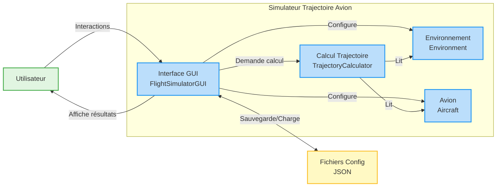
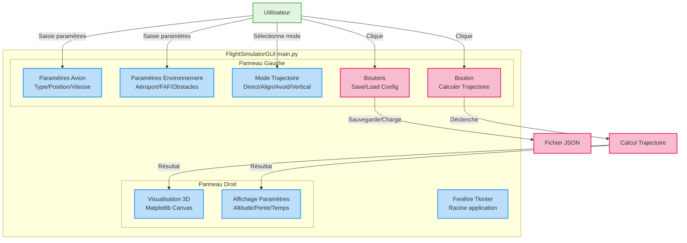
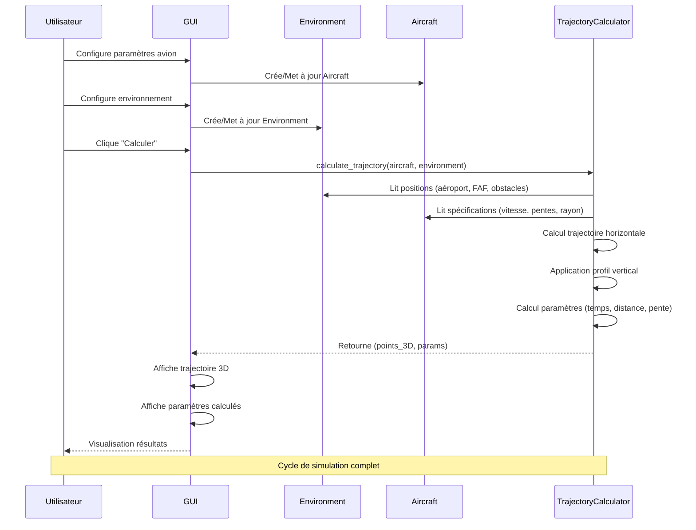

# ARCHITECTURE SYSTÈME - SIMULATEUR TRAJECTOIRE AVION P21

## 1. Vue d'ensemble - Architecture globale

**Description** : L'utilisateur interagit avec l'interface GUI qui orchestre l'ensemble du système. Le GUI configure l'environnement et l'avion, puis demande au calculateur de trajectoire de générer le parcours optimal.

---

## 2. Module GUI - Interface utilisateur

**Composants clés** :
- **Panneau Gauche** : Tous les contrôles de saisie des paramètres
- **Panneau Droit** : Visualisation 3D et affichage des résultats
- **Boutons d'action** : Calcul de trajectoire et gestion de configuration

---

## 3. Flux de données - Communication entre modules

**Flux séquentiel** :
1. Configuration initiale par l'utilisateur
2. Création des objets `Aircraft` et `Environment`
3. Déclenchement du calcul
4. Lecture des données par le calculateur
5. Calcul de la trajectoire
6. Retour et affichage des résultats

---

## Légende générale

- **Vert** : Points d'entrée/sortie (utilisateur, résultats)
- **Bleu** : Modules et processus principaux
- **Jaune** : Décisions et données de configuration
- **Rose** : Calculs et opérations critiques

## Description des modules

### Environment
Représente l'espace aérien avec :
- Dimensions de l'espace (size_x, size_y, size_z)
- Position aéroport et FAF
- Liste des obstacles cylindriques

### Aircraft
Modèle de l'avion avec :
- 3 types : Light, Commercial, Cargo
- Spécifications aérodynamiques (pentes max, vitesses, inclinaison)
- État dynamique (position, vitesse, cap)

### TrajectoryCalculator
Cœur du calcul de trajectoire :
- 4 types de trajectoires selon configuration
- Gestion altitude en 3 phases
- Évitement automatique d'obstacles

### GUI
Interface utilisateur complète :
- Configuration interactive des paramètres
- Visualisation 3D temps réel
- Sauvegarde/Chargement configuration
