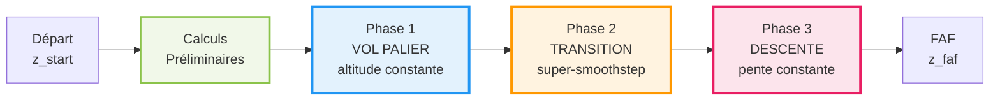
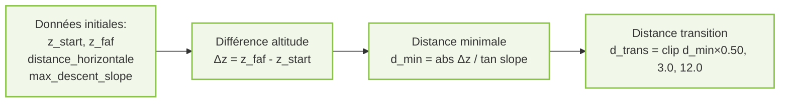
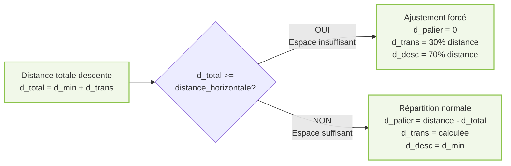
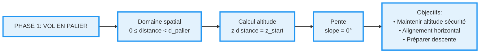
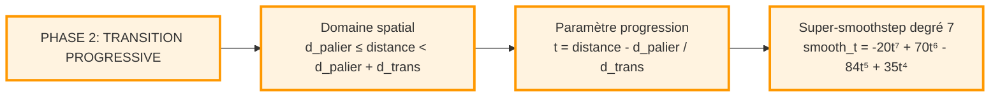
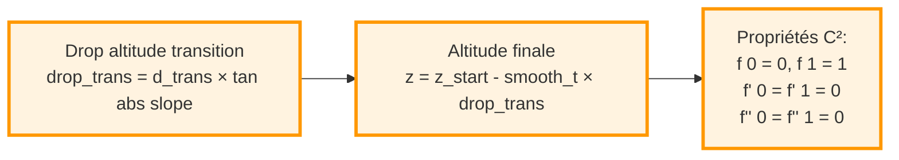
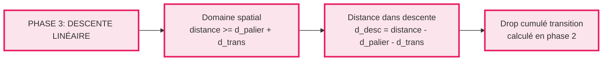
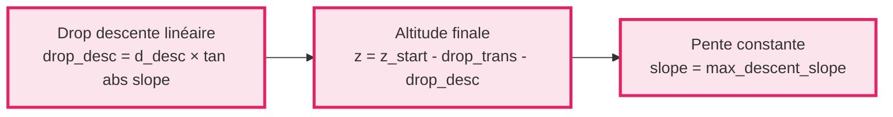
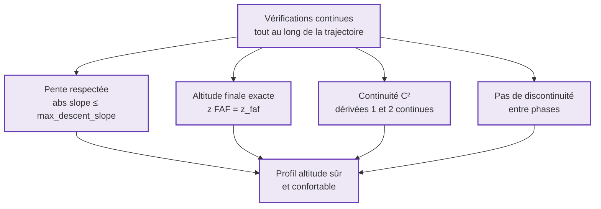

# GESTION ALTITUDE - Profil Vertical en 3 Phases (Version Compacte)

## 1. Schéma Global - Vue d'Ensemble



**Profil Altitude Résultant:**
```
altitude
│    ═══════  Phase 1
│           ╲
│            ╲ Phase 2
│             ╲___
│                 ╲___ Phase 3
│                     ╲___
└────────────────────────→ distance
```

---

## 2. Schéma Détaillé - Calculs Préliminaires





---

## 3. Schéma Détaillé - Phase 1 (Vol en Palier)



**Formules Phase 1:**
```
Domaine: 0 ≤ d < d_palier
Altitude: z(d) = z_start (constante)
Pente: slope = 0°
```

---

## 4. Schéma Détaillé - Phase 2 (Transition)





**Formules Phase 2:**
```
Domaine: d_palier ≤ d < d_palier + d_trans
Paramètre: t = (d - d_palier) / d_trans ∈ [0, 1]
Super-smoothstep: f(t) = -20t⁷ + 70t⁶ - 84t⁵ + 35t⁴
Drop: drop_trans = d_trans × tan(|slope_max|)
Altitude: z(d) = z_start - f(t) × drop_trans
```

---

## 5. Schéma Détaillé - Phase 3 (Descente)





**Formules Phase 3:**
```
Domaine: d ≥ d_palier + d_trans
Distance parcourue: d_desc = d - d_palier - d_trans
Drop transition: drop_trans (déjà calculé)
Drop descente: drop_desc = d_desc × tan(|slope_max|)
Altitude: z(d) = z_start - drop_trans - drop_desc
Pente: slope = max_descent_slope (constante)
```

---

## 6. Schéma Détaillé - Validation et Sécurité



---

## Résumé des Formules Clés

| Phase | Domaine | Formule Altitude |
|-------|---------|------------------|
| **Phase 1** | `0 ≤ d < d_palier` | `z = z_start` |
| **Phase 2** | `d_palier ≤ d < d_palier + d_trans` | `z = z_start - f(t) × drop_trans`<br/>où `t = (d - d_palier) / d_trans`<br/>et `f(t) = -20t⁷ + 70t⁶ - 84t⁵ + 35t⁴` |
| **Phase 3** | `d ≥ d_palier + d_trans` | `z = z_start - drop_trans - drop_desc`<br/>où `drop_desc = (d - d_palier - d_trans) × tan(\|slope\|)` |

**Calculs préliminaires:**
- `d_min = |Δz| / tan(|slope_max|)`
- `d_trans = clip(d_min × 0.50, 3.0, 12.0)`
- `d_total = d_min + d_trans`
- Si `d_total < distance_horizontale`: `d_palier = distance - d_total`
- Sinon: ajustement forcé avec `d_palier = 0`

---

## Exemples Numériques Détaillés

### Exemple 1 : Avion Commercial

**Spécifications initiales:**
- `max_descent_slope = -6.0°` (pente maximale de descente réglementaire)
- `altitude_start = 3.0 km = 3000 m` (altitude de croisière)
- `altitude_faf = 0.5 km = 500 m` (altitude du point FAF)
- `distance_horizontale = 40 km` (distance horizontale totale disponible)

---

#### Étape 1 : Calcul de la différence d'altitude

```
altitude_diff = altitude_faf - altitude_start
altitude_diff = 0.5 - 3.0 = -2.5 km (négatif = descente)
|altitude_diff| = 2.5 km = 2500 m à perdre
```

**Raisonnement:** L'avion doit perdre 2500 mètres d'altitude entre sa position actuelle et le FAF.

---

#### Étape 2 : Calcul de la distance minimale de descente (d_min)

```
tan(6°) ≈ 0.1051

d_min = |altitude_diff| / tan(|max_descent_slope|)
d_min = 2.5 km / 0.1051 ≈ 23.79 km ≈ 23.8 km
```

**Raisonnement:** En respectant la pente maximale de -6°, l'avion a besoin d'au moins 23.8 km pour descendre de 2500 m de manière linéaire. 

**Géométrie:** 
- Hypothénuse (trajectoire réelle) ≈ 23.87 km
- Base horizontale = 23.8 km
- Hauteur = 2.5 km
- Angle = 6°

---

#### Étape 3 : Calcul de la distance de transition (d_trans)

```
d_trans_brut = d_min × 0.50 = 23.8 × 0.50 = 11.9 km

Vérification des limites:
- Min autorisé : 3.0 km
- Max autorisé : 12.0 km
- Valeur calculée : 11.9 km ✓ (dans l'intervalle)

d_trans = 11.9 km (pas de clipping nécessaire)
```

**Raisonnement:** La distance de transition est fixée à 50% de la distance minimale de descente pour assurer une transition douce et confortable. Cette transition progressive permet d'éviter un changement brusque de pente qui serait inconfortable pour les passagers.

---

#### Étape 4 : Calcul de la distance totale de descente (d_total)

```
d_total = d_min + d_trans
d_total = 23.8 + 11.9 = 35.7 km
```

**Raisonnement:** L'avion a besoin de 35.7 km au total pour effectuer sa descente complète (transition + descente linéaire).

---

#### Étape 5 : Vérification de l'espace disponible

```
distance_horizontale = 40 km
d_total = 35.7 km

40 km > 35.7 km ✓ ESPACE SUFFISANT

Marge de sécurité = 40 - 35.7 = 4.3 km disponible
```

**Raisonnement:** L'avion dispose de suffisamment d'espace pour effectuer une descente normale. Les 4.3 km restants seront utilisés pour une phase de vol en palier au début.

---

#### Étape 6 : Répartition des phases

```
Phase 1 (Palier):
d_palier = distance_horizontale - d_total
d_palier = 40 - 35.7 = 4.3 km
Intervalle: [0 km → 4.3 km]
Pourcentage: 4.3 / 40 = 10.75%
Altitude: constante à 3000 m

Phase 2 (Transition):
d_trans = 11.9 km (déjà calculée)
Intervalle: [4.3 km → 16.2 km]
Pourcentage: 11.9 / 40 = 29.75%
Altitude: varie de 3000 m à ~1751 m (perte progressive)

Phase 3 (Descente linéaire):
d_desc = d_min = 23.8 km
Intervalle: [16.2 km → 40 km]
Pourcentage: 23.8 / 40 = 59.5%
Altitude: varie de ~1751 m à 500 m (pente constante -6°)
```

---

#### Étape 7 : Validation de la perte d'altitude

**Phase 2 - Perte pendant la transition (progressive):**
```
drop_trans = d_trans × tan(|slope|)
drop_trans = 11.9 × 0.1051 ≈ 1.25 km = 1250 m

Altitude fin transition = 3000 - 1250 = 1750 m
```

**Raisonnement Phase 2:** Pendant les 11.9 km de transition, l'avion commence à descendre progressivement avec le super-smoothstep. À la fin de cette phase, il aura perdu 1250 m.

---

**Phase 3 - Perte pendant la descente linéaire:**
```
Distance parcourue en Phase 3 = 40 - 4.3 - 11.9 = 23.8 km

drop_desc = 23.8 × tan(6°)
drop_desc = 23.8 × 0.1051 ≈ 2.50 km = 1250 m

Altitude finale = 1750 - 1250 = 500 m ✓ (altitude FAF atteinte exactement)
```

**Raisonnement Phase 3:** L'avion parcourt 23.8 km en descente linéaire à pente constante de -6°. Sur cette distance, il perd exactement les 1250 m restants pour atteindre le FAF.

---

**Vérification totale:**
```
Perte totale = drop_trans + drop_desc
Perte totale = 1250 + 1250 = 2500 m ✓

Distance Phase 2 + Phase 3 = 11.9 + 23.8 = 35.7 km = d_total ✓
```

**Observation importante:** 
- **`d_min = 23.8 km`** représente la distance nécessaire pour descendre **linéairement** 2500 m
- **Mais** avec la transition douce, on perd déjà 1250 m pendant `d_trans = 11.9 km`
- **Donc** il reste seulement 1250 m à perdre, ce qui nécessite **exactement 23.8 km** en pente linéaire
- **Coïncidence ?** Non ! C'est parce que `d_trans = 0.5 × d_min`, donc chaque phase perd la moitié de l'altitude totale

---

### Exemple 2 : Avion Léger

**Spécifications initiales:**
- `max_descent_slope = -10.0°` (avion léger plus agile)
- `altitude_start = 2.5 km = 2500 m`
- `altitude_faf = 0.5 km = 500 m`
- `distance_horizontale = 25 km`

---

#### Étape 1 : Calcul de la différence d'altitude

```
altitude_diff = 0.5 - 2.5 = -2.0 km
|altitude_diff| = 2.0 km = 2000 m à perdre
```

**Raisonnement:** Perte d'altitude plus faible que l'avion commercial (2000 m vs 2500 m).

---

#### Étape 2 : Calcul de la distance minimale (d_min)

```
tan(10°) ≈ 0.1763

d_min = 2.0 / 0.1763 ≈ 11.35 km ≈ 11.3 km
```

**Raisonnement:** Grâce à une pente plus raide (-10° vs -6°), l'avion léger peut descendre sur une distance horizontale beaucoup plus courte. La distance minimale est réduite de moitié par rapport à l'avion commercial.

---

#### Étape 3 : Calcul de la distance de transition

```
d_trans_brut = 11.3 × 0.50 = 5.65 km

Limites:
- Min: 3.0 km
- Max: 12.0 km
- Calculé: 5.65 km ✓

d_trans = 5.65 km (pas de clipping)
```

**Raisonnement:** Distance de transition proportionnellement plus courte, adaptée aux capacités de l'avion léger.

---

#### Étape 4 : Calcul de la distance totale

```
d_total = 11.3 + 5.65 = 16.95 km ≈ 17.0 km
```

---

#### Étape 5 : Vérification de l'espace

```
distance_horizontale = 25 km
d_total = 17.0 km

25 km > 17.0 km ✓ ESPACE LARGEMENT SUFFISANT

Marge = 25 - 17 = 8 km (32% de la distance totale!)
```

**Raisonnement:** L'avion léger dispose d'une marge confortable. Il peut maintenir l'altitude de croisière plus longtemps avant d'entamer sa descente.

---

#### Étape 6 : Répartition des phases

```
Phase 1 (Palier):
d_palier = 25 - 17.0 = 8.0 km
Intervalle: [0 km → 8.0 km]
Pourcentage: 8.0 / 25 = 32.0%
Altitude: constante à 2500 m

Phase 2 (Transition):
d_trans = 5.65 km
Intervalle: [8.0 km → 13.65 km]
Pourcentage: 5.65 / 25 = 22.6%
Altitude: varie de 2500 m à ~1503 m

Phase 3 (Descente):
d_desc = 11.3 km
Intervalle: [13.65 km → 25 km]
Pourcentage: 11.3 / 25 = 45.2%
Altitude: varie de ~1503 m à 500 m (pente -10°)
```

---

#### Étape 7 : Validation de la perte d'altitude

**Phase 2 - Perte pendant la transition (progressive):**
```
drop_trans = d_trans × tan(|slope|)
drop_trans = 5.65 × 0.1763 ≈ 0.996 km ≈ 1000 m

Altitude fin transition = 2500 - 1000 = 1500 m
```

**Raisonnement Phase 2:** Pendant les 5.65 km de transition, l'avion descend progressivement et perd 1000 m.

---

**Phase 3 - Perte pendant la descente linéaire:**
```
Distance parcourue en Phase 3 = 25 - 8.0 - 5.65 = 11.35 km ≈ 11.3 km

drop_desc = 11.3 × tan(10°)
drop_desc = 11.3 × 0.1763 ≈ 1.99 km ≈ 1000 m

Altitude finale = 1500 - 1000 = 500 m ✓ (altitude FAF atteinte exactement)
```

**Raisonnement Phase 3:** L'avion parcourt 11.3 km en descente linéaire à pente constante de -10°, perdant les 1000 m restants.

---

**Vérification totale:**
```
Perte totale = drop_trans + drop_desc
Perte totale = 1000 + 1000 = 2000 m ✓

Distance Phase 2 + Phase 3 = 5.65 + 11.3 = 16.95 km = d_total ✓
```

**Observation importante:** 
- Comme pour l'avion commercial, `d_trans = 0.5 × d_min`
- Donc chaque phase (transition et descente) perd exactement **la moitié** de l'altitude totale
- Phase 2 : 1000 m sur 5.65 km (pente progressive)
- Phase 3 : 1000 m sur 11.3 km (pente constante -10°)

---

## Comparaison des Deux Exemples

| Critère | Avion Commercial | Avion Léger | Observation |
|---------|------------------|-------------|-------------|
| **Pente max** | -6° | -10° | Avion léger plus agile |
| **Altitude à perdre** | 2500 m | 2000 m | Commercial plus haut |
| **Distance minimale** | 23.8 km | 11.3 km | Léger descend 2× plus vite |
| **Distance transition** | 11.9 km | 5.65 km | Proportionnel à d_min |
| **Distance totale descente** | 35.7 km | 17.0 km | Léger utilise 48% moins d'espace |
| **Phase palier** | 10.75% | 32.0% | Léger reste plus longtemps en altitude |
| **Phase transition** | 29.75% | 22.6% | Commercial nécessite transition plus longue |
| **Phase descente** | 59.5% | 45.2% | Commercial descend plus longtemps |
| **Marge sécurité** | 4.3 km | 8.0 km | Léger a plus de flexibilité |

**Conclusion:** L'avion léger, grâce à sa pente maximale plus importante, peut effectuer une descente beaucoup plus compacte, lui laissant davantage de marge de manœuvre. L'avion commercial nécessite une planification plus anticipée et utilise quasiment tout l'espace disponible.

---
