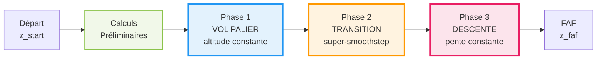
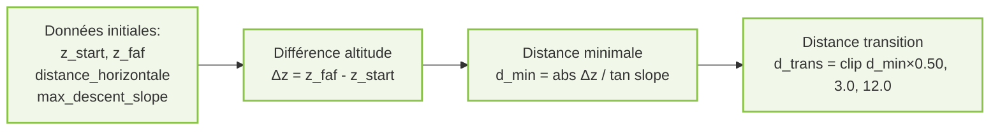
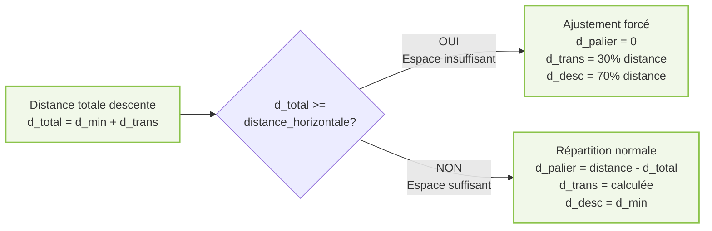
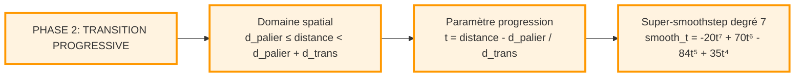
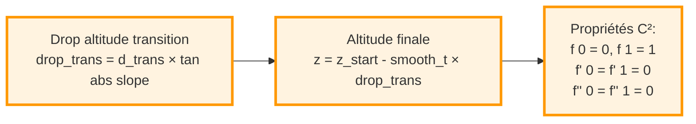
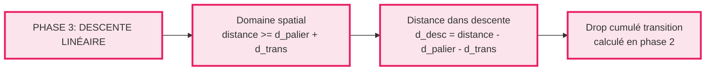
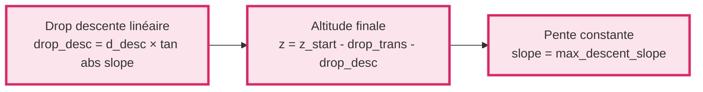
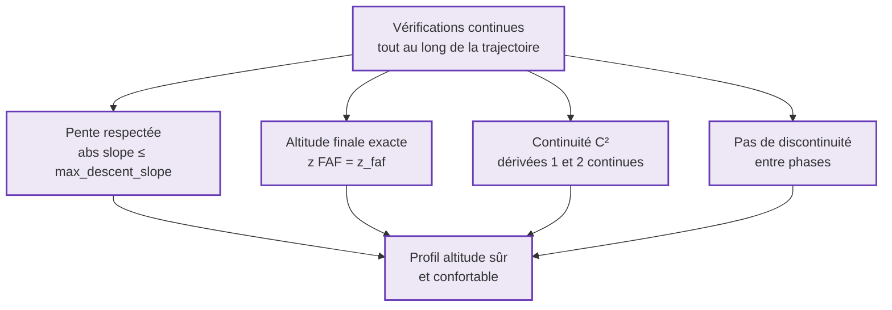

# GESTION ALTITUDE - Profil Vertical en 3 Phases (Version Compacte)

## 1. Schéma Global - Vue d'Ensemble



**Profil Altitude Résultant:**
```
altitude
│    ═══════  Phase 1
│           ╲
│            ╲ Phase 2
│             ╲___
│                 ╲___ Phase 3
│                     ╲___
└────────────────────────→ distance
```

---

## 2. Schéma Détaillé - Calculs Préliminaires





---

## 3. Schéma Détaillé - Phase 1 (Vol en Palier)


**Formules Phase 1:**
```
Domaine: 0 ≤ d < d_palier
Altitude: z(d) = z_start (constante)
Pente: slope = 0°
```

---

## 4. Schéma Détaillé - Phase 2 (Transition)





**Formules Phase 2:**
```
Domaine: d_palier ≤ d < d_palier + d_trans
Paramètre: t = (d - d_palier) / d_trans ∈ [0, 1]
Super-smoothstep: f(t) = -20t⁷ + 70t⁶ - 84t⁵ + 35t⁴
Drop: drop_trans = d_trans × tan(|slope_max|)
Altitude: z(d) = z_start - f(t) × drop_trans
```

---

## 5. Schéma Détaillé - Phase 3 (Descente)





**Formules Phase 3:**
```
Domaine: d ≥ d_palier + d_trans
Distance parcourue: d_desc = d - d_palier - d_trans
Drop transition: drop_trans (déjà calculé)
Drop descente: drop_desc = d_desc × tan(|slope_max|)
Altitude: z(d) = z_start - drop_trans - drop_desc
Pente: slope = max_descent_slope (constante)
```

---

## 6. Schéma Détaillé - Validation et Sécurité



---

## Résumé des Formules Clés

| Phase | Domaine | Formule Altitude |
|-------|---------|------------------|
| **Phase 1** | `0 ≤ d < d_palier` | `z = z_start` |
| **Phase 2** | `d_palier ≤ d < d_palier + d_trans` | `z = z_start - f(t) × drop_trans`<br/>où `t = (d - d_palier) / d_trans`<br/>et `f(t) = -20t⁷ + 70t⁶ - 84t⁵ + 35t⁴` |
| **Phase 3** | `d ≥ d_palier + d_trans` | `z = z_start - drop_trans - drop_desc`<br/>où `drop_desc = (d - d_palier - d_trans) × tan(\|slope\|)` |

**Calculs préliminaires:**
- `d_min = |Δz| / tan(|slope_max|)`
- `d_trans = clip(d_min × 0.50, 3.0, 12.0)`
- `d_total = d_min + d_trans`
- Si `d_total < distance_horizontale`: `d_palier = distance - d_total`
- Sinon: ajustement forcé avec `d_palier = 0`

---

## Exemples Numériques

### Avion Commercial
**Spécifications:**
- `max_descent_slope = -6.0°`
- `altitude_start = 3.0 km`
- `altitude_faf = 0.5 km`
- `distance_horizontale = 40 km`

**Calculs:**
```
altitude_diff = -2.5 km
tan(6°) ≈ 0.1051
min_descent_distance = 2.5 / 0.1051 ≈ 23.8 km
transition_distance = 23.8 × 0.50 = 11.9 km
total_descent = 23.8 + 11.9 = 35.7 km

distance_horizontale = 40 km > 35.7 km ✓

Répartition:
• Phase 1 (Palier): 0 → 4.3 km (10.75%)
• Phase 2 (Transition): 4.3 → 16.2 km (29.75%)
• Phase 3 (Descente): 16.2 → 40 km (59.5%)
```

### Avion Léger
**Spécifications:**
- `max_descent_slope = -10.0°`
- `altitude_start = 2.5 km`
- `altitude_faf = 0.5 km`
- `distance_horizontale = 25 km`

**Calculs:**
```
altitude_diff = -2.0 km
tan(10°) ≈ 0.1763
min_descent_distance = 2.0 / 0.1763 ≈ 11.3 km
transition_distance = 11.3 × 0.50 = 5.65 km
total_descent = 11.3 + 5.65 = 16.95 km

distance_horizontale = 25 km > 16.95 km ✓

Répartition:
• Phase 1 (Palier): 0 → 8.05 km (32.2%)
• Phase 2 (Transition): 8.05 → 13.7 km (22.6%)
• Phase 3 (Descente): 13.7 → 25 km (45.2%)
```

---
