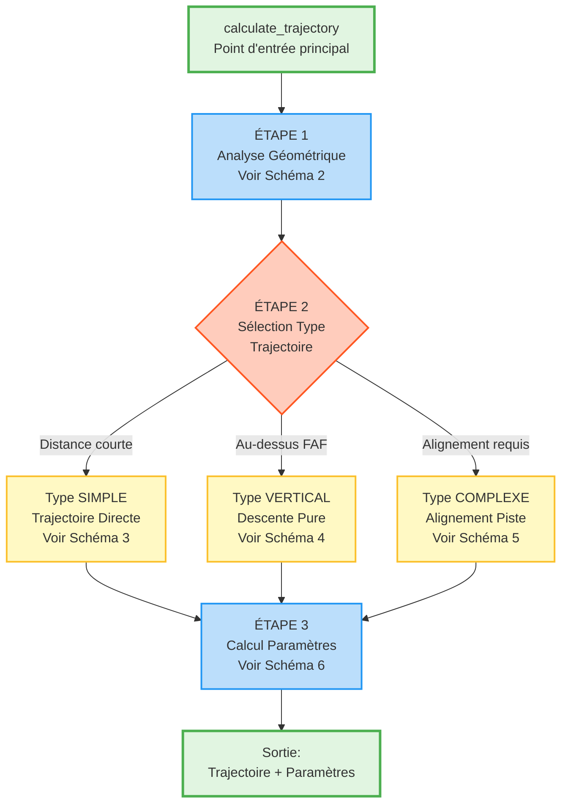
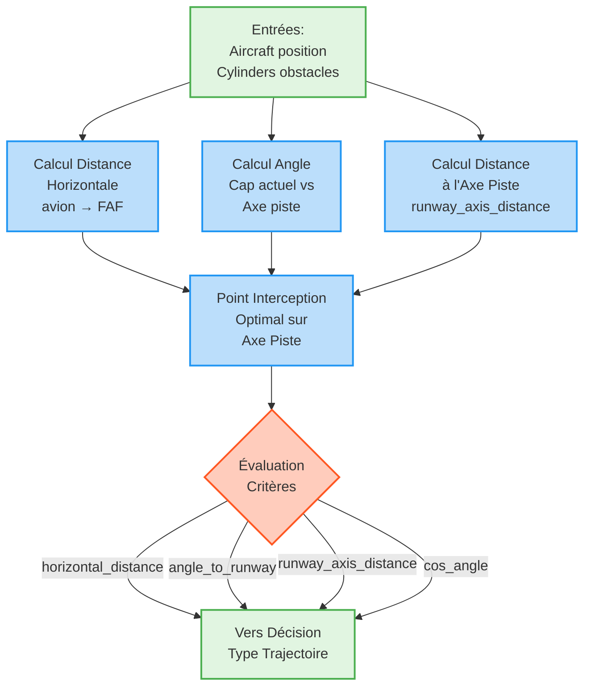
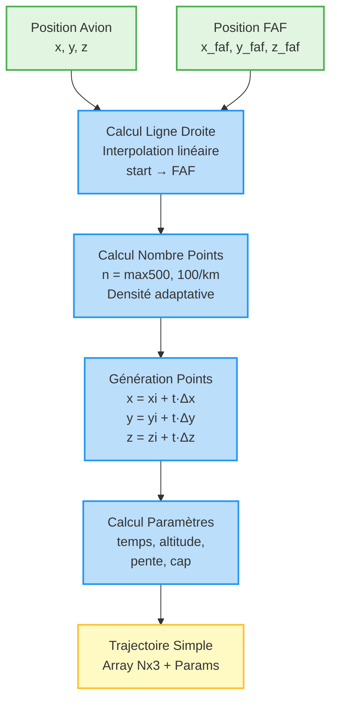
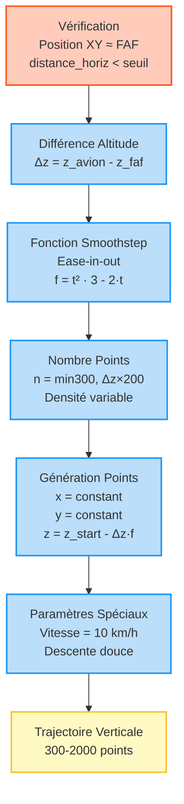
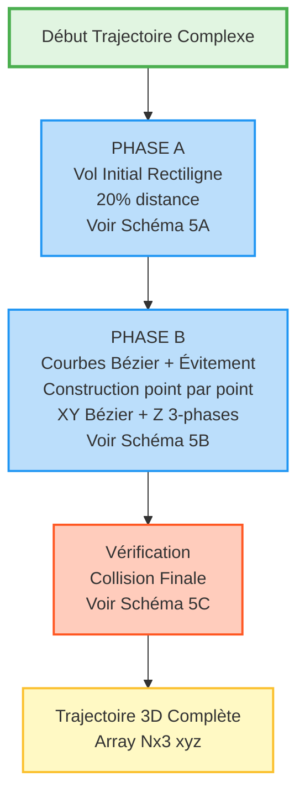
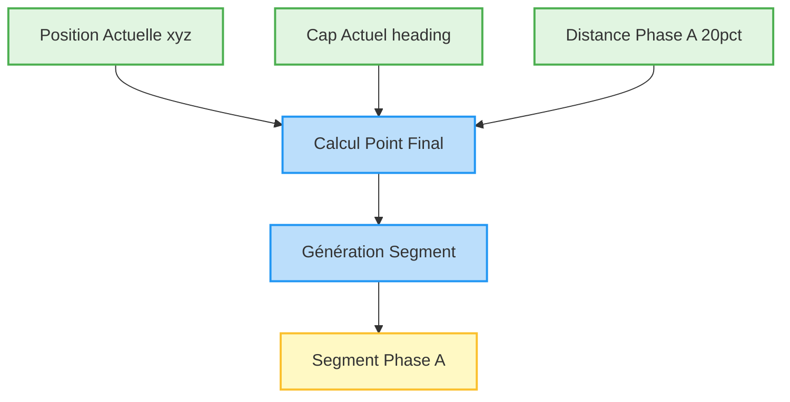
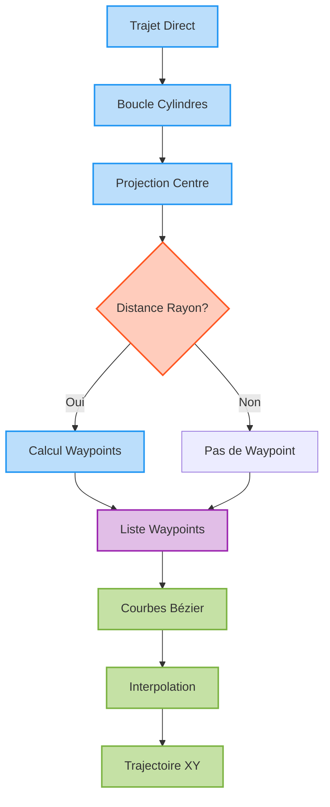
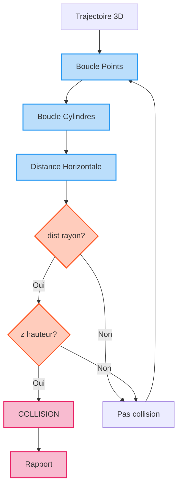
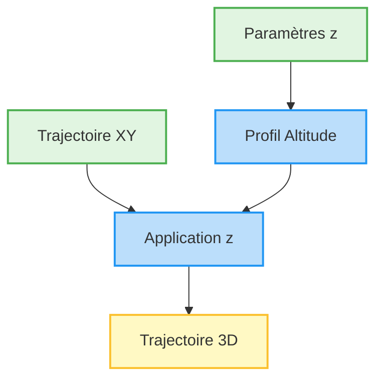
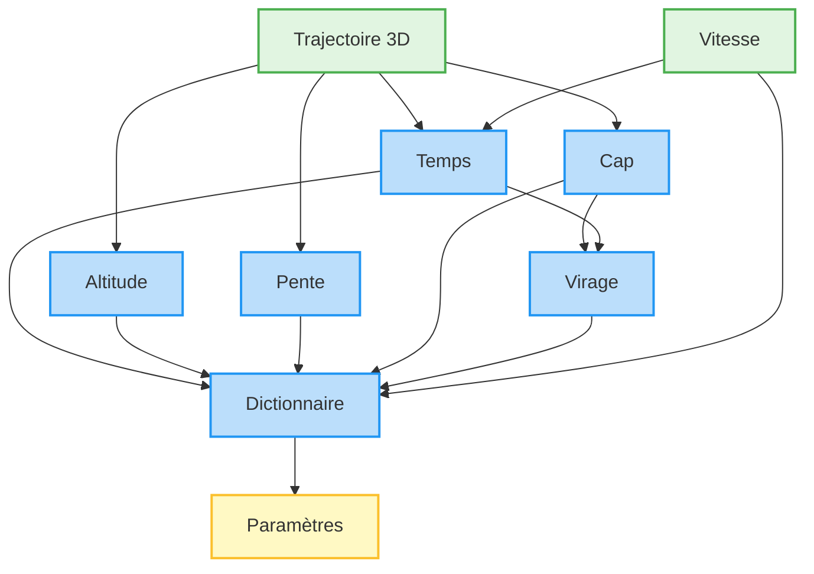

# DÉCOMPOSITION FONCTIONNELLE - TrajectoryCalculator

## SCHÉMA 1 - Vue d'Ensemble



**Légende:**
- **Vert**: Point d'entrée/sortie
- **Bleu**: Étapes de traitement
- **Orange**: Point de décision
- **Jaune**: Types de trajectoires

---

## SCHÉMA 2 - Analyse Géométrique Initiale



**Formules utilisées:**
- Distance horizontale: `√[(x_faf - x_avion)² + (y_faf - y_avion)²]`
- Angle: `arctan2(Δy, Δx)`
- Distance axe: produit scalaire perpendiculaire

---

## SCHÉMA 3 - Trajectoire Simple (Directe)



**Caractéristiques:**
- Type: Ligne droite
- Points: 500 à 10 000
- Complexité: O(n)
- Cas d'usage: Distance < seuil OU pas d'alignement requis

---

## SCHÉMA 4 - Trajectoire Verticale (Descente Pure)



**Formule Smoothstep:**
```
f(t) = t² · (3 - 2·t)
où t ∈ [0, 1]
Dérivées nulles en t=0 et t=1
```

---

## SCHÉMA 5 - Trajectoire Complexe - Vue d'Ensemble



**Note critique sur le calcul :**

La trajectoire est construite **point par point** dans une boucle unique où :
- **Coordonnées XY** : Calculées via courbes de Bézier cubiques
- **Coordonnée Z** : Calculée via profil 3 phases (palier/transition/descente)
- **Assignation** : `[x, y, z]` simultanée pour chaque point

**Il n'y a PAS de séparation temporelle** :
- ❌ Pas de trajectoire XY générée d'abord
- ❌ Pas de fusion ultérieure avec Z
- ✅ Calcul et assemblage **simultanés** dans la même itération

**Indépendance algorithmique** (pas temporelle) :
- La formule XY (Bézier) ne dépend pas de Z
- La formule Z (3 phases) ne dépend que de la distance 2D cumulée
- Les deux logiques s'exécutent **en parallèle** dans le code

**Détails des phases:**
- **Phase A**: 20% distance en ligne droite (altitude constante)
- **Phase B**: Détection obstacles + Construction courbes Bézier avec profil d'altitude intégré
- **Vérification**: Collision finale sur trajectoire 3D complète

---

## SCHÉMA 5A - Phase A: Vol Initial Rectiligne



**Calculs:**
```
distance_phase_a = max(200m, 20% × distance_totale)
x' = x + distance × cos(heading)
y' = y + distance × sin(heading)
z' = z (altitude maintenue)
```

**Objectif**: Laisser l'avion voler dans sa direction actuelle avant de commencer les manœuvres d'alignement

---

## SCHÉMA 5B - Phase B: Évitement Obstacles et Construction Bézier



**Formules Waypoints:**
```
perpendiculaire = [-dir_y, dir_x]
décalage = (rayon + marge_sécurité)
WP_entrée = projection - approach × direction + side × perp × décalage
WP_sortie = projection + approach × direction + side × perp × décalage
```

**Formule Bézier Cubique:**
```
P(t) = (1-t)³·P₀ + 3(1-t)²·t·P₁ + 3(1-t)·t²·P₂ + t³·P₃
Points contrôle:
  P₁ = P₀ + 0.35 × distance × direction
  P₂ = P₃ - 0.35 × distance × direction
Échantillonnage: 100-200 points par segment
```

---

## SCHÉMA 5C - Vérification Collision Finale



**Conditions collision:**
```
distance_horizontale = √[(x_point - x_centre)² + (y_point - y_centre)²]
collision = (distance_horizontale ≤ rayon) ET (z_point ≤ hauteur_cylindre)
```

---

## GESTION DE L'ALTITUDE - Traitement Parallèle

### Principe Général

L'altitude est calculée **indépendamment** de la trajectoire XY et appliquée sur tous les points de la trajectoire finale.



### Profil Altitude Tri-Phases


**PHASE 1 - Palier:**
- Distance: `0 → distance_palier`
- Altitude: `z = z_départ` (constant)

**PHASE 2 - Transition:**
- Fonction: Super-smoothstep ordre 7
- Formule: `f(t) = -20t⁷ + 70t⁶ - 84t⁵ + 35t⁴`
- Application: `z = z_start - Δz × f(t)`
- Propriétés: Dérivées 1ère et 2ème nulles aux extrémités

**PHASE 3 - Descente:**
- Pente: Maximale autorisée
- Mode: Linéaire jusqu'au FAF

**Avantages de cette approche:**
- Séparation des préoccupations (XY vs Z)
- Profil d'altitude indépendant des obstacles horizontaux
- Facilite les modifications ultérieures
- Performance optimisée (calcul vectoriel)

---

## SCHÉMA 6 - Calcul Paramètres Trajectoire



**Note:** L'altitude utilisée provient du profil calculé en parallèle

**Dictionnaire de sortie:**
```python
{
    'time': array,         # temps cumulé [s]
    'altitude': array,     # altitude [m]
    'slope': array,        # pente [deg]
    'speed': constant,     # vitesse [km/h]
    'heading': array,      # cap [deg]
    'turn_rate': array     # taux virage [deg/s]
}
```

---

## Complexité et Performance

| Fonction | Complexité | Points générés |
|----------|-----------|----------------|
| Simple | O(n) | 500 - 10000 |
| Verticale | O(n) | 300 - 2000 |
| Complexe | O(n×m×k) | 5000 - 50000 |

*n = points trajectoire, m = waypoints, k = obstacles*

---

## Formules Clés

**Distance minimale descente:**
```
d_min = |Δz| / tan(|max_descent_slope|)
```

**Bézier cubique:**
```
P(t) = (1-t)³P₀ + 3(1-t)²tP₁ + 3(1-t)t²P₂ + t³P₃
```

**Super-smoothstep:**
```
f(t) = -20t⁷ + 70t⁶ - 84t⁵ + 35t⁴
```

**Décalage perpendiculaire:**
```
perp = [-direction_y, direction_x]
waypoint = point_base + side × perp × (rayon + marge)
```
